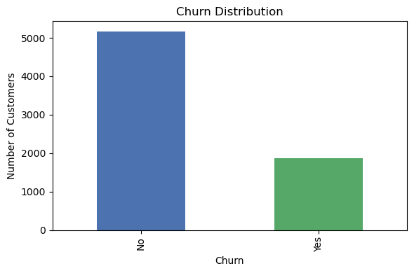
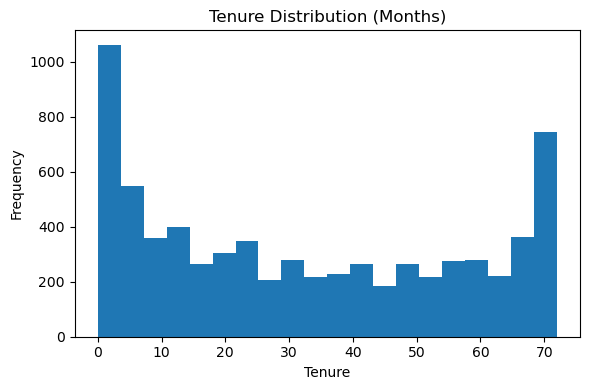
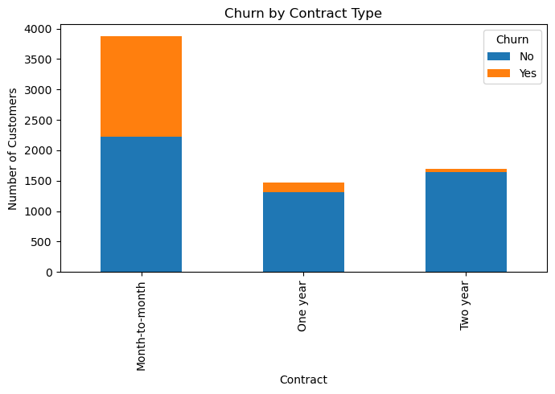
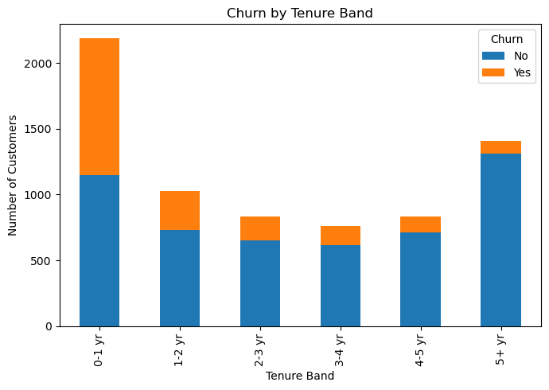

# Customer Churn Analysis (Telecom Industry)
*A Business Analytics Project focused on customer behavior, retention insights, and data-driven decision making.*

    

---

## 📌 Project Overview

Customer churn is a critical performance indicator for telecom companies, directly affecting revenue stability and customer lifetime value.  
This project uses SQL, Python, and exploratory data analysis (EDA) to help business stakeholders understand:

- Why customers churn  
- Which customer segments are most at risk  
- How contract type, payment method, tenure, and pricing influence churn  
- What targeted retention strategies the business should implement  

The goal is **actionable business insights**, not predictive modeling.

---

# 📊 Key Performance Indicators (KPIs)

<table>
  <tr>
    <td align="center" width="250">
      <h3>📉 Overall Churn Rate</h3>
      <h2>~27%</h2>
      
Industry-relevant churn level for telecom

    </td>
    <td align="center" width="250">
      <h3>👥 Total Customers Analyzed</h3>
      <h2>7,043*</h2>
      
(*Original IBM dataset reference)

    </td>
    <td align="center" width="250">
      <h3>⚠ High-Risk Segment</h3>
      <h2>Month-to-Month</h2>
      
Highest churn driver across all customer groups

    </td>
  </tr>
  <tr>
    <td align="center" width="250">
      <h3>💸 Avg. Monthly Charges</h3>
      <h2>$70–$75</h2>
      
Higher charges correlate with higher churn

    </td>
    <td align="center" width="250">
      <h3>⏱ Peak Churn Tenure</h3>
      <h2>0–12 Months</h2>
      
Early-life churn indicates onboarding issues

    </td>
    <td align="center" width="250">
      <h3>💳 Highest Churn Payment Method</h3>
      <h2>Electronic Check</h2>
      
Friction-heavy billing experience

    </td>
  </tr>
</table>

---

## 📂 Dataset Source

This project references the IBM **Telco Customer Churn** dataset:  
https://www.kaggle.com/datasets/blastchar/telco-customer-churn  

A synthetic subset (`customer_churn_sample.csv`, 100 rows) is used in this environment, mirroring the structure of the original dataset.

### Key Fields

- **Demographics:** gender, SeniorCitizen, Partner, Dependents  
- **Account Details:** customerID, tenure, contract type, payment method  
- **Services:** phone, internet, streaming, backups, tech support  
- **Financials:** MonthlyCharges, TotalCharges  
- **Outcome:** Churn (Yes/No)

---

## 📊 SQL Analysis (Business-Driven EDA)

The SQL script (`churn_analysis.sql`) includes analysis used by business and strategy teams:

### Insights Uncovered

#### **1️⃣ High churn among month-to-month customers**
They lack commitment, making them the highest-risk segment.

#### **2️⃣ Early-tenure churn is a major operational issue**
Customers leaving within the first 12 months indicates onboarding and experience gaps.

#### **3️⃣ High-value customers are churning**
Customers with higher monthly charges show elevated churn risk when perceived value is low.

#### **4️⃣ Payment method affects churn**
Electronic check customers churn at the highest rate—likely due to friction or poor user experience.

These findings guide retention campaigns, pricing adjustments, and CX improvements.

---

## 📉 Python Visualizations (Dashboard Style)

Below is the dashboard-style visualization section, using **your actual uploaded files**.

---

### **📌 Churn Overview & Customer Lifecycle**

    
    

---

### **📌 Financial Behavior & Revenue Patterns**

    
    

---

### **📌 Churn by Tenure Band**

    

---

## 🎯 Key Business Insights & Recommendations

### **1. Improve early-life customer experience**
Most churn occurs in months 0–12.  
➡ Strengthen onboarding and early retention programs.

### **2. Encourage long-term contracts**
Month-to-month customers churn the most.  
➡ Promote yearly contracts with discounts or loyalty benefits.

### **3. Reinforce value for high-paying customers**
Higher charges correlate with higher churn.  
➡ Offer bundles, value messaging, and proactive support.

### **4. Promote convenient payment methods**
Electronic check users churn the most.  
➡ Incentivize auto-pay or credit card billing.

These insights directly support retention strategy, pricing decisions, and customer value management.

---

# Customer Churn Analysis (Telecom Industry)
*A Business Analytics Project focused on customer behavior, retention insights, and data-driven decision making.*

